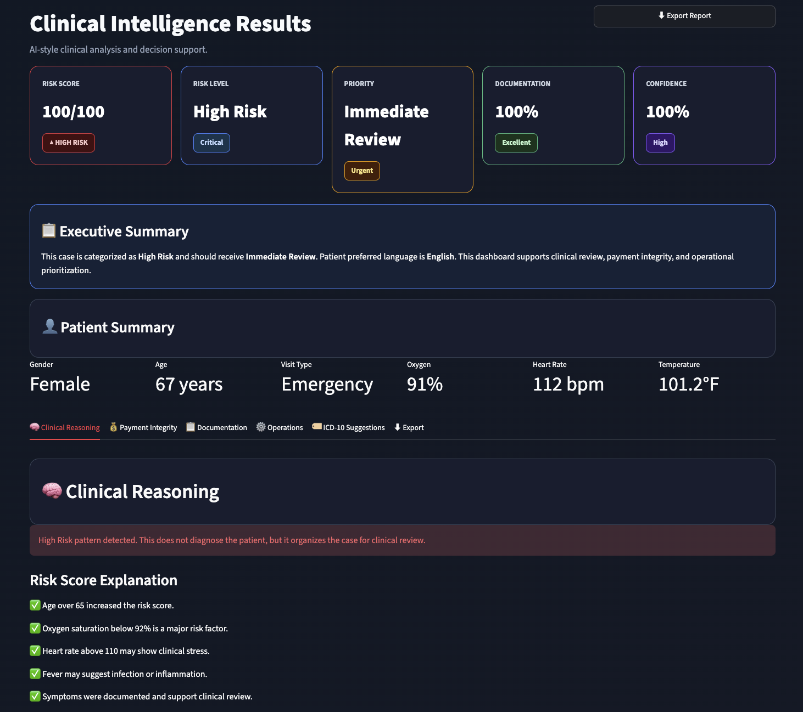

# 🏥 Cotiviti Clinical Intelligence Platform

## Overview

The Cotiviti Clinical Intelligence Platform is a healthcare analytics proof of concept developed using Python and Streamlit. The application demonstrates how clinical decision support can assist healthcare professionals by organizing patient information, identifying higher-risk patients, and supporting Treatment, Payment, and Operations (TPO).

This project was developed as part of a healthcare AI internship assessment to demonstrate clinical decision-making and pattern recognition in healthcare.

---

## Features

- 🩺 Clinical Risk Assessment
- 🧠 Clinical Decision Support
- 📋 Documentation Review
- 💰 Payment Integrity Review
- ⚙️ Operations Recommendations
- 🏷 Educational ICD-10 Suggestions
- 📄 Exportable Clinical Report
- 🌍 Patient Language Selection

---

## Technologies Used

- Python
- Streamlit
- Rule-Based Clinical Decision Engine
- Healthcare Analytics

---

## System Workflow

```
Patient Data
      ↓
Clinical Risk Analysis
      ↓
Documentation Review
      ↓
Operations Recommendations
      ↓
Export Report
```

---

## Project Screenshot



---

## Installation

Clone the repository:

```bash
git clone <repository-url>
cd cotiviti-ai-clinical-decision-support
```

Install the required packages:

```bash
pip install -r requirements.txt
```

Run the application:

```bash
streamlit run app.py
```

---

## Project Structure

```
cotiviti-ai-clinical-decision-support/
│
├── app.py
├── requirements.txt
├── README.md
├── report.pdf
└── presentation.pptx
```

---

## Future Improvements

- Electronic Health Record (EHR) Integration
- Large Language Model (LLM) Support
- Predictive Analytics
- Multilingual Clinical Summaries
- Real-Time Healthcare Data Integration

---

## Disclaimer

This project is an educational proof of concept developed for demonstration purposes only. It does not provide medical advice and should not be used for clinical decision-making.

---

## Author

**Misgana Okbagaber**

University of Washington

Healthcare Analytics • Python • Streamlit